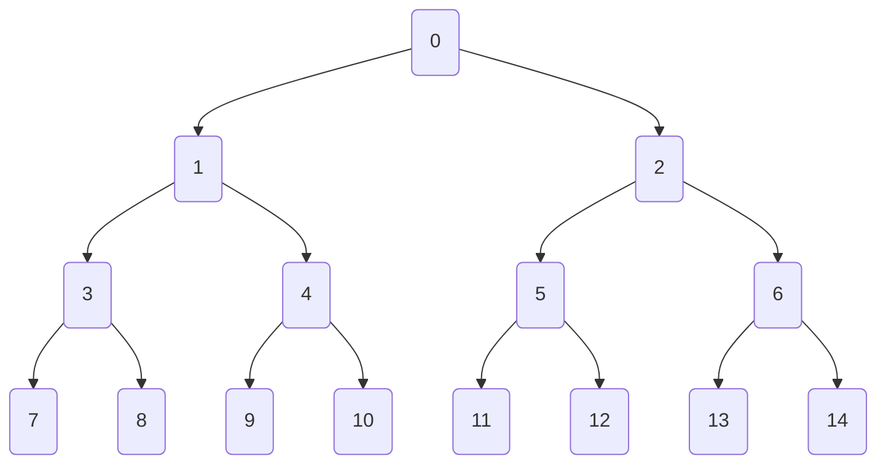

# Реализация ДО на отрезках
Есть несколько вариантов реализации ДО. Однако основными считаются: *указатели* и *массив*. У каждого есть плюсы и минусы. Но мы расмотрим на массиве.

## Массив
Нам нужно как-то упаковать дерево в массив. Для начала обозначим его размер. В предыдущий раз мы доказывали, что достаточно $2n$ вершин, однако это происходит только в идеальных случаях, когда $n = 2^k$. Мы же рассмотрим худщий из возможных случаев $n =2^k + 1$ у нас появляются 2 дополнительные вершины, которые не помещаються в $2^k$.

```mermaid
---
title: n = 5
---
flowchart TD;
	0:::level0 --> 1:::level1
	0 --> 2:::level1
	1 --> 3:::level2
	1 --> 4:::level2
	2 --> 5:::level2
	2 --> 6:::level2
	6 --> 13:::level3
	6 --> 14:::level3

classDef level0 fill:#402020
classDef level1 fill:#204020
classDef level2 fill:#202040
classDef level3 fill:#402040
```

Заметим, что если $n=2^k$, то для $n=4$ вершин 7, для $n=8$ вершин 15, то есть $2 \cdot n-1$. Тут же добавляются ещё 2 вершины справа, и непонятно куда их девать. Достроим дополнительный слой(большинство вершин которого будет пустыми). В идеале нам нужно найти такое $k$, что $n \le 2^k \implies k = \lceil \log{n} \rceil$ и тогда длина упакованного массива $N = 2^{k+1}-1$ . Однако это очень запарно писать, поэтому попытаемся как-то это сократить. Рассмотрим самый худший случай($n = 2^{k-1} + 1$ и $N = 2^{k+1} - 1$)

$$
\frac{N}{n} = \frac{2^{k+1}-1}{2^{k-1}+1} = \frac{4 \cdot 2^{k-1} - 1}{2^{k-1}+1} = \frac{4 \cdot (2^{k-1} + 1) - 4 - 1}{2^{k+1}+1} = 4 - \frac{5}{2^{k+1}+1} < 4
$$

$$
\implies N < 4n
$$

Тогда самый удобный вариант написания: `N = 4 * n`. Однако если есть очень большое ограничение по памяти, то оптимальнее писать `N = (1 << (__lg(n - 1) + 2)) - 1`, в самом лучшем случае он требует в 2 раза меньше памяти.

Как же нам упаковать ДО в данный массив? Пронумеруем каждый слой по порядку. Окажеться, что для кажой вершины(не являющееся листом) с номером $v$, номера сыновей равны $2v + 1$ и $2v + 2$ для левого и правого сына соответственно.


Адаптируем каждую функцию по определению. Будем делять реализацию на полуинтервалах, $[l, r)$, однако каждый может переработать под себя. 
```c++
// Исходный массив
vector<int> a;

// Создаём структуру для удобства.
// Если будет храниться несколько параметров,
// то не придётся вводить какие-то костыли.
struct Node {
	long long sum;
};
vector<Node> t;

// Объявляем функцию merge,
// которая будет объединять 2 вершины
Node merge(Node &a, Node &b) {
	// Хоть она и выглядит очень просто, 
	// для более сложных задач она будет
	// очень полезна
	Node res;
	res.sum = a.sum + b.sum; 
	return res;
}

// Построить поддерево вершины v
// где [l, r) - полуинтрервал, за который
// отвечает данная вершина
// (нигде иначе мы это не храним)
void build(int v, int l, int r) {
	if (r - l == 1) { // единичный отрезок
		t[v] = a[l];
		return;
	}
	// середина текущего полуинтервала
	int m = (l + r) / 2;
	build(2 * v + 1, l, m); // влево
	build(2 * v + 2, m, r); // вправо
	// Формируем значение текущей вершины
	t[v] = merge(t[2 * v + 1], t[2 * v + 2]);
}

// Обновление всех нужных вершин поддерева v.
// Изменяем элемент массива i на x.
void update(int v, int l, int r, int i, int x) {
	if (r - l == 1) {
		t[v] = x;
		return;
	}
	int m = (l + r) / 2;
	// проверяем, какой ребёнок отвечает за
	// номер i
	if (i < m) {
		update(2 * v + 1, l, m, i, x);
	} else {
		update(2 * v + 2, m, r, i, x);
	}
	// не забываем обновиться
	t[v] = merge(t[2 * v + 1], t[2 * v + 2]);
}

// Возвращаем ответ для пересечении
// [l, r) и [lq, rq).
Node get(int v, int l, int r, int lq, int rq) {
	// полуинтервал [l, r) полностью лежит в [lq, rq)
	if (l >= lq && r <= rq) {
		return t[v];
	} else if (l >= rq || r <= lq) { 
		// полуинтервал полностью [l, r) не входит в [lq, rq)
		return {0}; // нейтральный элемент
	}
	int m = (l + r) / 2;
	// ответы для левого и правого ребёнка
	Node left = get(2 * v + 1, l, m, lq, rq);
	Node right = get(2 * v + 2, m, r, lq, rq);
	return merge(left, right); // объединяем
}

...

// где-то в main
a.resize(n);
t.resize(4 * n);
// или
// t.resize((1 << (__lg(n - 1) + 2)) - 1);

```

Все функции нужно изначально вызывать с параметрами $f(v=0, l=0, r=n, \dots)$ - это стартовые параметры. Так как мы решили упаковать всё дерево в массив, то для каждой вершины мы не храним его полуинтервал $[l, r)$. Поэтому нам приходиться передавать данные параметры в каждой функции, более быстрого метода вычисления нету(и не нужно).
