# Отложенные операции
Изменим исходную задачу(искать сумму на отрезке). Теперь нам нужно изменять не 1 элемент массива, а несколько: для каждого $k \in [l, r)$ сделать присвоение `a[k] = x`. Однако хотим мы это сделать без ухудшения асимптотики: обрабатовать все запросы за $O(\log{n})$.

## Основная идея
Мы не хотим спускаться до каждого листа и делать присвоение: оно может быть слишком долгим. Чтобы изменить все элементы, придётся пройтись по всему дереву.

Основная идея такая: у нас есть вершины, у которых все дети при операции изменяются. Не будем запускать обход по всем дочерним вершинам: вместо этого будем это делать прямо во время другого запроса. То есть, если пришёл запрос изменить весь массив $a$, то фактически будет изменена только 1 корневая вершина.

```mermaid
---
title: Запрос a[2, 6] = 10
---
flowchart TD;
	0(62):::recurs --> 1(25):::recurs
	0 --> 2(37):::recurs
	1 --> 3(5)
	1 --> 4(20):::one
	2 --> 5(20):::one
	2 --> 6(17):::recurs
	3 --> 7(2)
	3 --> 8(3)
	4 --> 9(1):::zero
	4 --> 10(8):::zero
	5 --> 11(12):::zero
	5 --> 12(6):::zero
	6 --> 13(10):::one
	6 --> 14(7)

classDef zero fill:#402020
classDef one fill:#204020
classDef recurs fill:#202040
```

*Зелёные* вершины - те, которые будут изменены, *синие* - которые обновлены, а *красные* - которые должны быть обновлены в идеальном случае.

Теперь, при каждом запросе, нам нужно удостовериться, что данная вершина *корректна*, а у детей есть информация, чтобы востановить ответ. Для этого создадим функция *проталкивания*: обновляем текущую вершину, а для детей говорим, на какое значение нужно измениться: они сами разберуться потом.

## Реализация
Теперь нам нужно изменить несколько функций, а также поменять структуру ноды:
```c++
struct Node {
	int sum = 0;
	int assign = -1;
	// На какое значение нужно измениться
	// -1 означает, что присвоения делать не нужно
};
vector<Node> t;

void push(int v, int l, int r) {
	// если надо делать присвоение
	if (t[v].assign == -1) return;
	// обновляем на длину отрезка * искомое значение
	t[v].sum = (r - l) * t[v].assign;
	if (r - l != 1) { // если есть дети
		t[2 * v + 1].assign = t[v].assign;
		t[2 * v + 2].assign = t[v].assign;
	}
	// не забываем обнулить
	t[v].assign = -1;
}
```

А перед вызовом каждой функции будем вызывать функцию проталкивания(`push`): гарантия того, что значения в ноде корректны.
```c++
Node merge(Node &a, Node &b) {
	return {a.sum + b.sum};
}

// Обновление всех нужных вершин
// для пересечения [l, r) и [lq, rq) = x
void add(int v, int l, int r, int lq, int rq, int x) {
	push(v, l, r);
	if (l >= lq && r <= rq) {
		t[v].assign = x;
		push(v, l, r);
		return;
	} else if (l >= rq || r <= lq) {
		return;
	}
	int m = (l + r) / 2;
	add(2 * v + 1, l, m, lq, rq, x);
	add(2 * v + 2, m, r, lq, rq, x);
	// не забываем обновить себя
	t[v] = merge(t[2 * v + 1], t[2 * v + 2]);
}

// Найти сумму на пересечении
// [l, r) и [lq, rq)
void sum(int v, int l, int r, int lq, int rq) {
	push(v, l, r); // добавился только push здесь
	if (l >= lq && r <= rq) {
		return t[v];
	} else if (l >= rq || r <= lq) {
		return {};
	}
	int m = (l + r) / 2;
	Node left = sum(2 * v + 1, l, m, lq, rq);
	Node right = sum(2 * v + 2, m, r, lq, rq);
	return merge(left, right);
}
```

Асимптотика при этом не изменяется, мы просто делаем на $O(1)$ больше операций.
