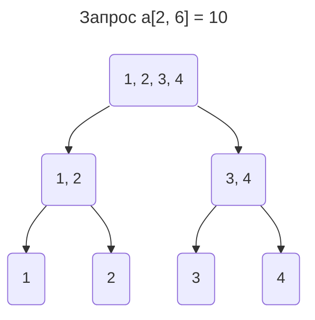

# Merge sort tree
**Задача.** Дан массив $a$ и $q$ запросов, для каждого из которых нужно отвечать: сколько элемент в отрезке $[l, r]$ такие что $a_i \le x$.

Построим дерево отрезков, где в каждой вершине будем хранить все элементы массива, за которые данная вершина отвечает, и при том в отсортированном виде. 


Докажем несколько свойств:
1. **Пямять**, занимаемая деревом, будет равна $O(n \log{n})$. Так как каждый элемент храниться только в вершинах предков, а количество таких вершин равно высоте дерева $\log{n}$, и всего элементов в массиве $n$, следовательно память равна $O(n \log{n})$.
2. **Объединение 2 вершин** работает за линейное время $O(n)$, где $n$ - длина итогового массива в вершине. Так как в 2-х дочерних вершинах храняться 2 отсотрированных массива, то их объединение делается за линейное время(с помощью 2 указателей).
3. Из этого следует, что **время построения** тоже равно $O(n \log{n})$ - оно зависит от памяти дерева.

Это чем-то похоже на алгоритм сортировки слиянием (*merge sort*), поэтому дерево и называется **merge sort tree** (MST).

Вернёмся к исходной задаче: как это поможет нам отвечаться на запросы? Делаем всё тоже самое, что и при ДО, однако вместо возвращения значения в вершине, делаем бинарный поиск по $x$ в массиве данной вершины. А так как у нас элементы в массиве отсортированны, нам это не составит особого труда.

Асимптотика такова: теперь для каждой вершины мы делаем не $O(1)$ операций, а $O(\log{n})$. Тогда всё вместе $O(q \log{n} \log{n}) = O(q \log^2{n})$

## Реализация
```c++
// Для удобства
#define all(x) (x).begin(), (x).end()

struct Node {
	vector<int> el; // массив элементов вершины
};

// Объединяем массивы вершин a и b -> c
void merge(Node &a, Node &b, Node &c) {
	c.el.clear(); // очищаем массив
	// воспользуемся стандартной функцией stl
	merge(all(a.el), all(b.el), back_inserter(c.el));
}

void build(int v, int l, int r) {
	// ...
	// всё тоже самое что и раньше кроме этого:
	merge(t[2 * v + 1], t[2 * v + 2], t[v]);
}

int get(int v, int l, int r, int lq, int rq, int x) {
	if (l >= lq && r <= rq) {
		return distance(
			t[v].el.begin(), 
			lower_bound(all(t[v].el), x)
			// находим элемент >= x
		);
	}
	// ...
	// остальное всё такое же
}
```