# Дерево отрезков
Лучше всего осознать важность данной структуры можно на конкретной задача: дан какой-либо массив $a$ длиной $n$, и нам нужно отвечать на $q$ запросов вида:
1. Узнать сумму на отрезке $[l, r]$
2. Изменить элемент $a_i = x$

Можно было бы конечно обрабатывать это *в тупую*: считать для каждого отрезка его сумму, однако данный алгоритм работает за $O(q \cdot n)$. Более опытные вспомнят про массив префиксных сумм, однако из-за операции присвоения элемента, нам каждый раз придётся пересчитывать данный массив(в худшем случае за $O(n)$), и в итоге получается всё теже $O(q \cdot n)$.

Над нашим массивом сделаем данные манипуляции: посчитаем сумму всего массива, и куда-то запишем. Разделим данный массив попалам, посчитаем сумму для каждого по отдельности и тоже куда-нибудь запишем. Проделаем такую работу пока длина массивов не станет равной единице. 

```mermaid
flowchart TD;
	0(47):::level0 --> 1(26):::level1
	0 --> 2(19):::level1
	1 --> 3(10):::level2
	1 --> 4(16):::level2
	2 --> 5(9):::level2
	2 --> 6(10):::level2
	3 --> 7(2):::level3
	3 --> 8(8):::level3
	4 --> 9(12):::level3
	4 --> 10(4):::level3
	5 --> 11(3):::level3
	5 --> 12(6):::level3
	6 --> 13(9):::level3
	6 --> 14(1):::level3

classDef level0 fill:#402020
classDef level1 fill:#204020
classDef level2 fill:#202040
classDef level3 fill:#402040
```

```mermaid
flowchart TD;
	0("[0, 7]"):::level0 --> 1("[0, 3]"):::level1
	0 --> 2("[4, 7]"):::level1
	1 --> 3("[0, 1]"):::level2
	1 --> 4("[2, 3]"):::level2
	2 --> 5("[4, 5]"):::level2
	2 --> 6("[6, 7]"):::level2
	3 --> 7("[0, 0]"):::level3
	3 --> 8("[1, 1]"):::level3
	4 --> 9("[2, 2]"):::level3
	4 --> 10("[3, 3]"):::level3
	5 --> 11("[4, 4]"):::level3
	5 --> 12("[5, 5]"):::level3
	6 --> 13("[6, 6]"):::level3
	6 --> 14("[7, 7]"):::level3

classDef level0 fill:#402020
classDef level1 fill:#204020
classDef level2 fill:#202040
classDef level3 fill:#402040
```

Для каждого элемента будет соответствовать какой-то отрезок(для корня $[0; n)$ полуинтервал). Поэтому сама структура называется **дерево отрезков**.

## Свойства
Для удобной работы нам нужно рассмотреть некоторые свойства:

**Высота** дерева $\approx \log{n}$. Этот факт следует из того, что на каждом уровне(снизу вверх) количество вершин делиться пополам.

**Память** - для хранение дерева нужна линейная память. Память выделяется только для вершин, а значит она зависит от количества вершин. На каждом слое вершин вдвое меньше, чем на предыдущем. Образуется ряд $n; \frac{n}{2}; \frac{n}{4}; \frac{n}{8}; \dots$ А его сумма

$$
n + \frac{n}{2} + \frac{n}{4} + \dots < 2n
$$

То есть для хранение дерева отрезков нужна линейная память.

## Применение
Используя свойства выше можно быстро обрабатывать запросы. Далее будут расмотрены общие варианты алгоритмов, которые подходят для всех реализаций(с небольшими модификациями) дерева отрезков.

Для начала нужно **построить** само дерево. Напишем рекурсивную функцию($build$):
1. Если вершина - лист(отрезок, за который отвечает данная вершина единичной длины) то записываем значение из массива в вершину.
2. Иначе вызываем данную функцию от левого и правого ребёнка
3. И *обновляем* текущую вершинку $val_v = merge(val_{l}, val_{r})$ - где $val_v$ - значение вершины $v$, а $merge$ - какая-то функция объединения вершин (более подробно мы рассмотрим её далее)

В исходной задаче $merge$ - сумма 2 вершин. \
Так как мы посещаем каждую вершину только 1 раз, то асимптотика $O(n)$

Опишем теперь функцию **получения** значения для отрезка $[l, r]$ (тоже рекурсивная, $get$):
1. Если отрезок вершины полностью лежит на отрезке запроса, то возвращаем значение данной вершины
2. Если отрезок вершины вообще не пересекается с отрезком запроса, то возвращаем *нейтральный элемент* (тот, который вообще не будет учитываться в итоговом ответе, в сумме - 0)
3. Иначе рекурсивно делимся на 2 половины и возвращаем $merge(get(l), get(r))$

И теперь самое интересное. Данная функция выполняется за $O(\log{n})$. \
**Доказательство.** Рассмотрим какой-либо слой. На нём нас интересуют только вершины, которые лежат на границе отрезков, именно они вызывают рекурсию(другие выполняются мгновено). Таких вершин всегда максимум 2(ведь отрезки вершин не пересекаются, а концов всего 2). Слоёв в ДО равно высоте дерево, то есть $2 \cdot \log{n} = O(\log{n})$.

```mermaid
---
title: Запрос [2, 6]
---
flowchart TD;
	0(34):::recurs --> 1(16):::recurs
	0 --> 2(18):::recurs
	1 --> 3(0):::zero
	1 --> 4(16):::one
	2 --> 5(9):::one
	2 --> 6(9):::recurs
	3 --> 7(?)
	3 --> 8(?)
	4 --> 9(?)
	4 --> 10(?)
	5 --> 11(?)
	5 --> 12(?)
	6 --> 13(9):::one
	6 --> 14(0):::zero

classDef zero fill:#402020
classDef one fill:#204020
classDef recurs fill:#202040
```

*Зелёный* - возвращает значение вершины, *красный* - нейтральный элемент, *синий* - вызов функции от дочерних вершин.

Ну и самая последняя функция - **обновление** значение в *массиве*:
1. Если отрезок единичный, то изменяем значелие $p_v = x$ и выходим
2. Иначе проверяем, где находиться такой элемент: в левом или в правом поддереве
3. Рекурсивно запускаем оттуда функцию
4. Обновляем текущую вершину $val_v = merge(val_l, val_r)$

Каждый раз мы спускаемся вниз по дереву, а значит время работы: $O(\log{n})$

```mermaid
---
title: val[5] = 0
---
flowchart TD;
	0(39):::update --> 1(26)
	0 --> 2(13):::update
	1 --> 3(10)
	1 --> 4(16)
	2 --> 5(3):::update
	2 --> 6(10)
	3 --> 7(2)
	3 --> 8(8)
	4 --> 9(12)
	4 --> 10(4)
	5 --> 11(3)
	5 --> 12(0):::one
	6 --> 13(9)
	6 --> 14(1)

classDef one fill:#204020
classDef update fill:#202040
```

*Зелёный* - обновление, *синий* - вызов функции от дочернего элемента.

Теперь рассмотрим поближе $merge$ - объединение 2 вершин. В нашем примере это была сумма, однако *какие функции* вообще *подходят*? Для этого достаточно **ассоциативности**:

$$
a \circ (b \circ c) = (a \circ b) \circ c
$$

или же

$$
merge(a, merge(b, c)) = merge(merge(a, b), c)
$$

для нашего примера:

$$
a + (b + c) = (a + b) + c
$$

Для каждой функции есть свой нейтральный элемент. Вот некоторые примеры:

| $f_c$ | пример       | нейтральный элемент |
| ----- | ------------ | ------------------- |
| $sum$ | $a + b$      | 0                   |
| $max$ | $max(a, b)$  | $-\infty$           |
| $min$ | $min(a, b)$  | $\infty$            |
| $xor$ | $a \oplus b$ | $0$                 |
| $or$  | $a \lor b$   | $0$                 |
| $and$ | $a \land b$  | $111111\dots$       |