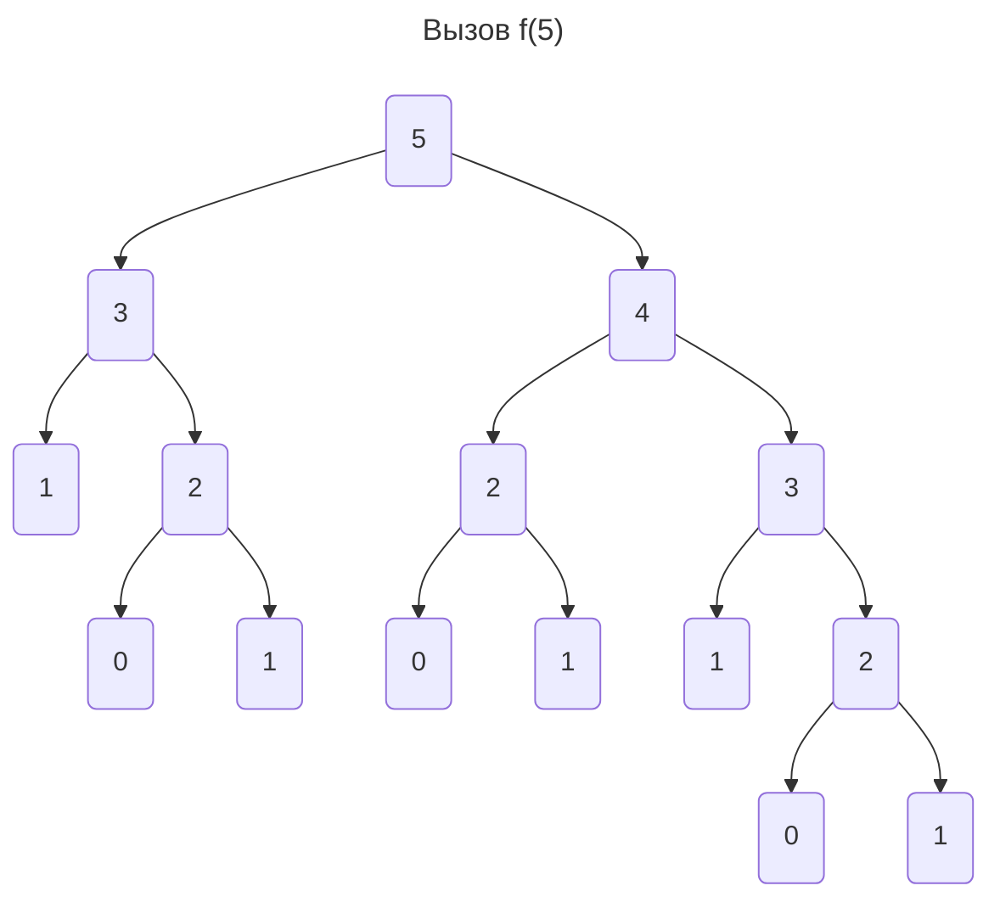

# Динамическое программирование
**Динамическое программирование** - способ решения сложной задачи с помощью разделения на маленькие.

**Задача.** Нужно найти $n$-е число Фибоначчи. По определению:

$$
\begin{aligned}
f_0 &= 0 \\
f_1 &= 1 \\
f_n &= f_{n - 2} + f_{n - 1}
\end{aligned}
$$

Напишем самую наивную рекурентную реализацию:
```c++
int f(int n) {
	if (n < 2) {
		return n;
	}
	return f(n - 2) + f(n - 1)
}
```
Однако даже при маленьких числах данная функция будет выполняться очень долго.

**Заметим**, что функция может вызываться несколько раз при 1 и тех же параметрах:


Основная идея - запоминать предыдущие результаты. Создадим массив для данной задачи
```c++
vector<int> f(n);

f[0] = 0;
f[1] = 1;
for (int i = 2; i < n; i++) {
	// для больших чисел нужно считать по модулю
	f[i] = f[i - 2] + f[i - 1];
}
```

Это уже работает за $O(n)$ - очень быстро.

## Алгоритм решения
Можно обобщить данный подход для решения других задач. Вот примерный алгоритм решения:
1. **Разделить на подзадачи.**
2. **Составить рекурентный алгоритм.**
3. **Привести к итерационной форме.**

Более детально, вот ключевые моменты, с которыми надо разобраться:
1. Состояние: что находиться в ячейке массива?
2. Начальные значения
3. Формула пересчёта
4. Порядок обхода
5. Местонахождение ответа