# НОП
**Общая подпоследовательность** - такая последовательность, которая является подпоследовательностью сразу нескольких последовательностей(обычно 2). Более формально, есть две последовательности:

$$
\begin{aligned}
A &= (a_1, a_2, a_3, \dots, a_n) \\
B &= (b_1, b_2, b_3, \dots, b_m) 
\end{aligned}
$$

А также набор индексов

$$
\begin{matrix}
1 \le i_1 < i_2 < \dots < i_p \le n \\
1 \le j_1 < j_2 < \dots < j_p \le m
\end{matrix}
$$

Таких, что выполняется:

$$
\begin{matrix}
a_{i_1} = b_{j_1} \\
a_{i_2} = b_{j_2} \\
\vdots \\
a_{i_p} = b_{j_p}
\end{matrix}
$$

Интереснее всего для нас нахождение такой **наибольшей**(англ. *LCS*). Например:

```mermaid
block-beta
columns 7
A["a: "]

block:a:6
a1("1") a2("8") a3("4") a4("13") a5("5") a6("2")
end
  
B["b:"]
block:b:5
b1("8") b2("13") b3("4") b4("2") b5("6")
end
space
  
a2 --> b1
a3 --> b3
a6 --> b4
  
classDef a_style fill:#202040
classDef b_style fill:#204020
  
class a2 a_style
class a3 a_style
class a6 a_style
  
class b1 b_style
class b3 b_style
class b4 b_style
```

Здесь `8, 4, 2` - наибольшая общая подпоследовательность(также есть `8, 13, 2`).

## Алгоритм
Рассмотрим какие-то последовательности:

$$
\begin{aligned}
A &= (a_1, a_2, \dots, a_n) \\
B &= (b_1, b_2, \dots, b_m) \\
Z &= (z_1, z_2, \dots, z_p) \text{ - НОП } A \text{ и } B \\
\end{aligned}
$$

А также набор индексов для НОП

$$
\begin{matrix}
1 \le i_1 < i_2 < \dots < i_p \le n \\
1 \le j_1 < j_2 < \dots < j_p \le m
\end{matrix}
$$

Есть 2 случая:
1. Если $a_n = b_m = z_p$ тогда $i_p = n$ и $j_p = m$. Из этого следует, что если убрать последний символ из всех последовательностей, то $(z_1, \dots, z_{p - 1})$ будет *НОП* для $(a_1, \dots, a_{n - 1})$ и $(b_1, \dots, b_{m - 1})$.
2. Если какой-то из последних символов не является последним символом $Z$, тогда либо $i_p < n$, либо $j_p < m$. Из этого следует, что $Z$ - *НОП* для какой-либо последовательности $(a_1, \dots, a_{n - 1})$ или $(b_1, \dots, b_{m - 1})$.

Из этого можно вывести рекурентную функцию. Пусть $LCS$ - длина *НОП* для префикса последовательностей $(a_1, \dots, a_i)$ и ($b_1, \dots, b_j$).

$$
LCS(i, j) = max
\begin{cases}
LCS(i - 1, j) \\
LCS(i, j - 1) \\
LCS(i - 1, j - 1) + 1 \text{ если } a_i = b_j
\end{cases}
$$

Определим базовый случай:

$$
LCS(i, 0) = LCS(0, j) = 0
$$

Переведём в итеративную форму. Пусть есть двухмерный массив `lcs[i][j]` - максимальная длина НОП для префикса массива `a[0..i]` и для префикса массива `b[0..j]`. Будем итерироваться по `i = 1..n` и `1..m`.
```c++
int dp[n + 1][m + 1];
for (int i = 0; i <= n; i++) // базовые случаи
	dp[i][0] = 0;

for (int j = 0; j <= m; j++)
	dp[0][j] = 0;

for (int i = 0; i <= n; i++) {
	for (int j = 0; j <= m; j++) {
		dp[i][j] = max(dp[i - 1][j], dp[i][j - 1]);
		if (a[i - 1] == b[j - 1]) {
			dp[i][j] = dp[i - 1][j - 1] + 1;
		}
	}
}
```
Итоговая сложность по времени и памяти равна $O(n \cdot m)$.

Для восстановления исходной НОП можно завести массив `prev`, и запоминать в нём откуда мы взяли значения. Например, если `a[i - 1] == b[j - 1]`, то `prev[i][j] = {i - 1, j - 1}`. Итеративно идём вверх, добавляя нужные значения:
```c++
int i = n, j = m;
vector<int> res;
while (i != 0 && j != 0) {
	if (prev[i][j] == pair(i - 1, j - 1)) {
		res.push_back(a[i]); // если мы добавили новый элемент в НОП
	}
	// поднимаемся вверх
	i = prev[i][j].first;
	j = prev[i][j].second;
}
reverse(res.begin(), res.end());
```

## Оптимизация памяти
Если нам не нужно восстанавливать ответ, то можно добиться оптимизации памяти. Заметим, что на каждой итерации по `i` мы используем лишь 2 слоя `dp[i]` и `dp[i - 1]`. Сделаем следующее: вместо всего массива `dp[i][j]`, будем хранить лишь `dp_prev` и `dp_cur` - предыдущий и текущий слой соответствено. А на каждой новой итерации менять их местами.
```c++
if (n < m) { // для оптимизации делаем m <= n всегда
	swap(n, m);
	swap(a, b);
}

vector<int> dp_prev(m + 1);
vector<int> dp_cur(m + 1);

for (int i = 1; i <= n; i++) {
	dp_prev.swap(dp_cur); // меняем за O(1)
	for (int j = 1; j <= m; j++) {
		dp_cur[j] = max(dp_prev[j], dp_cur[j - 1]);
		// ...
	}
}
```