# Точки сочленения
**Точки сочленения** - такая вершина, при удалении которой граф распадается на несколько компонент связности.

Воспользуемся тем же массивом как в *мостах*. Можно сказать, что если в каком-либо поддереве дочерней вершины $u$ нет обратного ребра "вверх", то начальная вершина $v$ - точка сочленения, то есть нет другого пути от $u$ до остального графа.

```mermaid
graph TD
1 --> 2
2 --> 3
2 --> 4(v)
4 --> 5(u)
4 --> 6
6 --> 7
6 --> 8
6 --> 9
9 --> 2

style 4 fill:#400000,stroke:#ff0000
style 5 fill:#004000,stroke:#00ff00

linkStyle 8 stroke:#606060,stroke-width:1px
```

Существует 2 случая:
1. **v - не корень.** Если есть такая дочерняя вершина, что $ret_u \ge h_v$ то $v$ - точка сочленения
2. **v - корень.** Тогда достаточно проверить, что во время обхода из корня мы посетили не менее 2 дочерних вершин, значит эта вершина - точка сочленения. 