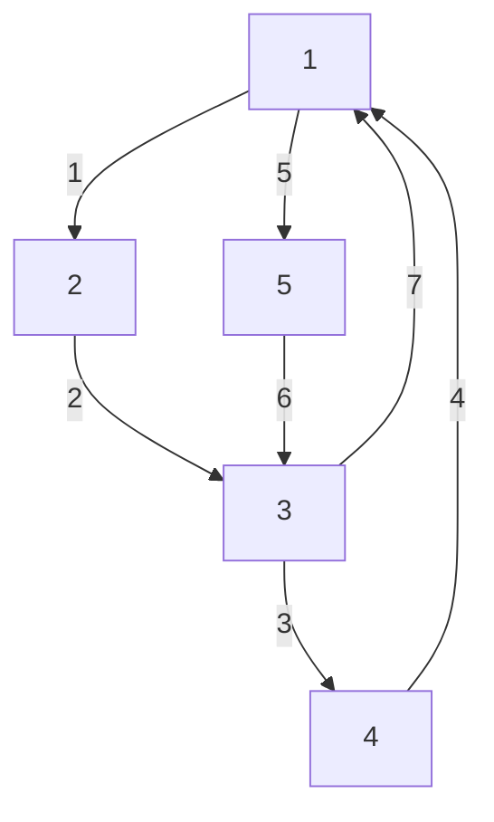

# Эйлеров цикл
**Эйлеров путь** - путь, проходящий по всем рёбрам в графе. \
**Эйлеров цикл** - эйлеров путь, являющийся циклом. 



**Лемма.** Если есть эйлеров цикл, то степень каждой вершины чётна. \
**Доказательство.** Выстроим цепочку вершин, в порядке их обхода. Заметим, что в каждую вершину мы вошли и вышли одинаковое количество раз, а значит степень каждой вершины чётна. 

Для ориентированного графа нужно также проверить что количество входящих = количество исходящих рёбер.

Алгоритм построения цикла рекурсивен. Сначала выбираем любую вершину. Удаляем любое ребро, инцидентное с данной вершиной, и запускаем данный алгоритм с другого конца этого ребра.
```python
def euler(v):
    while (not g[v].empty()):
        u = g[v][0]
        remove_edge(v, u)
        euler(u)
    print(u) # выводим результат
```

Единственная проблема - как быстро *удалять рёбра*. Можно при хранении графа в списке смежности использовать `set`. Тогда для удаления какого-либо ребра нам надо сделать `g[v].erase(u)`, и обратно, если граф неориентирован. Данный алгоритм будет работать за $O(m\cdot\log{n})$.

Если в графе есть петли и кратные рёбра, то нужно использовать `multiset` и функцию `extract`.

## Эйлеров путь
Для путей эйлера ограничение чуть меньше. Для начала можно заметить: \
**Утверждение.** Количество вершин с нечётной степенью кратно 2-м. \
**Доказательство.** При добавлении ребра в граф мы изменяем степень сразу 2 вершин. Это означает, что мы либо не изменим количество вершин с нечётной степенью, либо увеличим/уменьшим их на 2. Из этого следует, что количество таких вершин будет кратно 2-м.

В эйлеровом пути степень всех вершин чётна, либо(если концы не равны) нечётна только для концов. Из этого следует, что построить такой путь мы сможем только если количество *нечётных вершин не более 2*. Для этого достаточно запустить предыдущий алгоритм из вершины, степень которой *нечётна*.