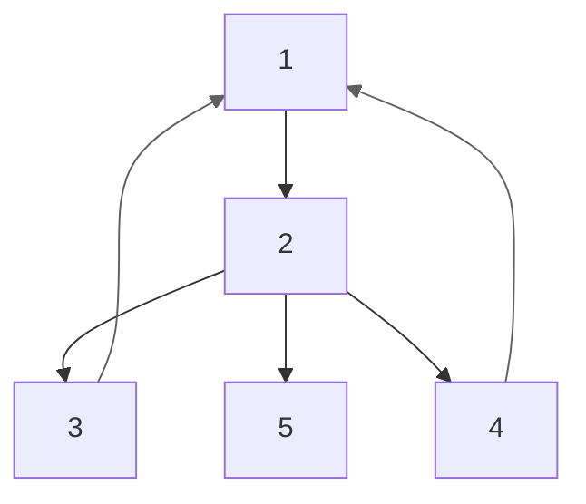

# Нахождение цикла (не)чётной длины
**Задача.** Проверить, есть ли в графе цикл *нечётной* длины. \
**Теорема.** Для проверки достаточно 1 обратное ребро. \
**Доказательство.** Допустим, что в таком цикле есть 2 обратных ребра. Но тогда его можно поделить на 2 части: одна из них будет чётна, а другая наоборот. А значит мы нашли другой цикл нечётной длины, в котором только 1 обратное ребро. \ 
Если же в цикле более 2-х обратных рёбер, то его можно разбивать по очереди(делением пополам).

Из этого следует, что достаточно для каждого *обратного ребра* $v \to u$ проверить $h_v - h_u \equiv 0 \pmod 2$

**Задача.** Проверить, есть ли в графе цикл *чётной* длины. \
Здесь дело обстоит посложнее. Можно привести пример, где есть цикл только из 2-х обратных рёбер(4 - 1 - 3 - 2 - 4):

%% TODO: автор не понял как это решать %%