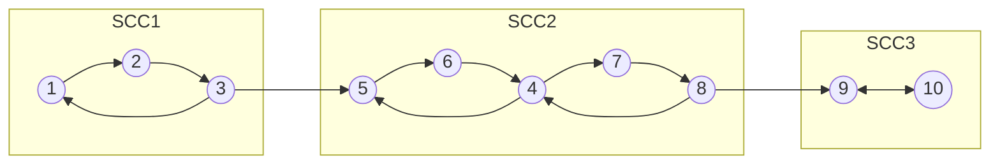

# Компоненты сильной связности
**Определение.** В ориентированном графе две вершины $v$ и $u$ сильно связаны, если есть какой-либо путь $v \to u$, и наоборот $u \to v$. \
Из определения также следует, что данные вершины лежат в каком-то цикле.

Обозначим сильную связность двух вершин как $sc(v, u)$.

Это отношение эквивалентности:
1. **Рефлексивность** - $sc(v, v) = 1$ так как всегда есть путь $v \to v$
2. **Симметричность** - если $sc(v, u) \iff sc(u, v)$ - здесь доказывать тоже нечего
3. **Транзитивность** - 
   
$$
\left.
\begin{array}{l}
sc(v, u) \\
sc(v, t)
\end{array}
\right\\} \implies
sc(u, t)
$$

Доказательство очень простое. Чтобы попасть из $u$ в $t$(или наоборот), достаточно пройти через вершину $v$, ведь путь к нему у обоих вершин есть. 

Из этого следует, что все вершины разбиваются на отдельные *компоненты сильной связности*(КСС). 

**Конденсация графа** - это такое представление графа, при котором каждая компонента сильной связности представляется в виде 1 вершины сконденсированного графа. \
Конденсация графа полезна тем, что в нём *нет циклов*. \
**Доказательство.** Допустим, в таком графе есть цикл. Но тогда вершины $v \in A$ и $u \in B$ в разный компонентах смогут добраться друг до друга. Но это значит, что они в 1 компоненте сильной связности $\implies$ противоречие.

Для построения графа нам полезно доказать следующее: \
**Теорема.** Если в конденсации есть ребро $A \to B$, то $\max_{v \in A} tout_v > \max_{u \in B} tout_u$ (максимальный $tout$ у вершин компоненты $A$ больше чем у $B$), где $tout$ - выход из вершины во время обхода. \
**Доказательство.** Для доказательство надо рассмотреть 2 случая
1. Если мы вошли в $B$ *раньше*, чем в $A$. Если такое произошло, то мы просто не попадём в компоненту $A$, ведь нет какого-то другого пути $B \to A$, ведь иначе бы образовался цикл, что противоречит предыдущему доказательству. То есть в этот раз мы не посетим КСС $A$.
2. Если мы вошли в $A$ *раньше*, чем в $B$. Посещая все вершины $v \in A$ мы бы в какой-то момент обнаружили исходное ребро $A \to B$, а значит все вершины $u \in B$ мы должны были обязательно посетить, прежде чем обратно вернуться в компоненту $A$. Из этого следует, что мы из $B$ вышли раньше, а значит теорема выполняется 

Из данного доказательства следует алгоритм нахождения КСС. Отсортируем все вершины в обратном порядке убывания выхода из них. Рассмотрим компоненту *первой* вершины: так как у неё максимальный $tout$, то нет никаких компонент, *входящих в* данную. Это значит, что в *транспонированном* графе(перевёрнуты все рёбра) нет рёбер *выходящих из* этой компоненты. Однако сама КСС не изменилась(если поменять рёбра местами, то сильная связность между вершинами не поменяется), а значит все достижимые вершины состоят в одной КСС.

Итоговый алгоритм:
1. Сортируем вершины в порядке убывания выхода из них($tout$)
2. Если вершина не отмечена, то запускаем $dfs$ от транспонированного графа из этой вершины
3. Всё, до чего смогли дотянуться состоят в 1 КСС.
4. Повторяем, пока не будут отмечены все вершины