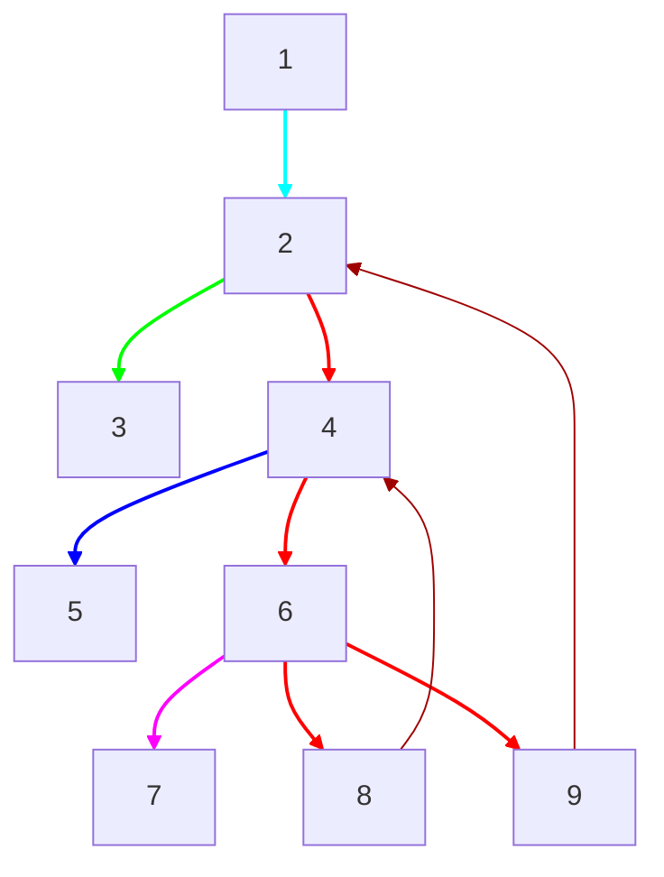

# Вершинная двусвязность
Существует 2 определения: 
1. Два ребра $a_1 \iff b_1$ и $a_2 \iff b_2$ вершинно двусвязны, если существуют вершино непересекающиеся пути ($a_1 \iff a_2$ и $b_1 \iff b_2$) или ($a_1 \iff b_2$ и $b_1 \iff a_2$).
2. Два ребра $a_1 \iff b_1$ и $a_2 \iff b_2$ вершино двусвязны, если они лежат на вершино простом цикле. 

Далее в параграфе будем обозначать знак $\approx$ как 2 ребра вершино двусвязны.

Полезно доказать отношение **эквивалентности**:
1. **Рефлексивность** - одно и то же ребро вершино двусвязно само с собой
2. **Симметричность** - если ребра $a_1 \iff b_1 \approx a_2 \iff b_2$, то верно и обратное
3. **Транзитивность** - самое сложное для доказательства свойство. 
   
   $$
   \left.
   \begin{array}{l}
   (a_1 \iff b_1) & \approx & (a_2 \iff b_2) \\
   (a_2 \iff b_2) & \approx & (a_3 \iff b_3)
   \end{array}
   \right\} \implies
   (a_1 \iff b_1) \approx (a_3 \iff b_3)
   $$
   %% TODO: приложить доказательство%%

Из этого отношения следует, что все рёбра можно разбить на разные *компоненты*, причём такое разбиение будет только одно. 



**Задача.** Разбить все ребра на разные компоненты, где каждое ребро вершино двусвязно с другим. \
**Решение.** Будем действовать в 2 прохода. Сначала построим массив $ret$ как в задаче о *мостах*. Заметим, что обратное ребро образует вершино простой цикл. То есть, если во время обхода у нас есть цепочка $par \to v \to u$, и у вершин поддерева $u$ есть какое-то обратное ребро выше вершины $v$, то $(par \to v) \approx (v \to u)$. Для этого достаточно проверить условие $ret_u < h_v$. Иначе мы создаём новую компоненту. Для обратного ребра $(v \to u)$ всегда выполняется $(par \to u) \approx (v \to u)$.

Итоговый алгоритм на псевдо коде:
```python
def dfs(v, par_idx):
	used[v] = 1
	for u, idx in g[v]:
		if par_idx == idx: continue
		if (!used[v]): # прямое ребро
			if ret[u] < h[v]: # есть какое-то обратное ребро наверх
				comp[idx] = comp[par_idx]
			else:
				comp[idx] = comp[++cnt] # создаём новую компоненту
			dfs(u, idx)
		elif (comp[idx] == -1): # непомеченное обратное ребро
			com[idx] = com[par_idx]
```

Если в графе есть кратные рёбра, то надо делать проверку на ребро, ведущее к предку, по индексу этого ребра. В данном алгоритме это учтено.